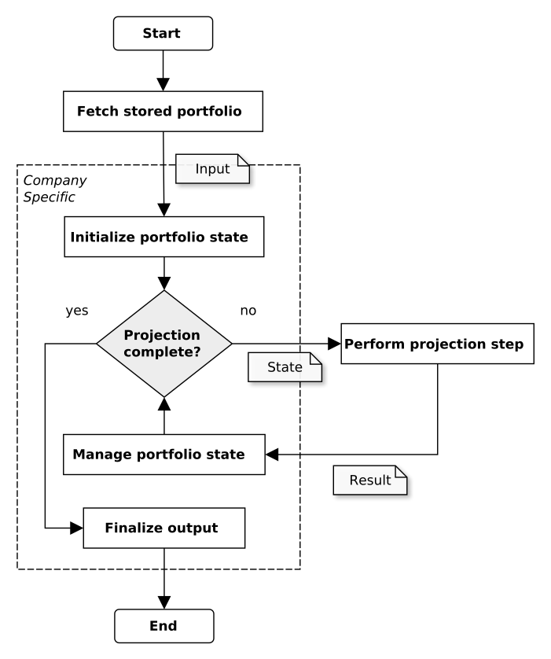
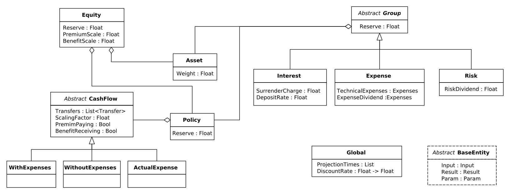

Introduction
====================================

This page gives a small introduction to MAL. First, we give a brief explanation of how MAL fits into a projection, then we explain how model data in MAL, and at last we examine an example program.

Projection
^^^^^^^^^^^^

Below you see a flowchart modeling the projection of a portfolio.
The flowchart considers three types of portfolio data, namely:

  * *Input* coming from a database (during testing from some Excel sheets).
  * *State* produced by an init and manage step.
  * *Result* produced by a projection step.

The purpose of MAL is to initialize a portfolio during the initialize portfolio state* step and subsequently managing it during the mange steps.

The *initialize portfolio state* step uses the input to initialize a portfolio state.
The state both contains values required by the projection and custom values company specific values.
As long as the projection is incomplete, *PROBABLI* will *perform projection step* which produces a projection result from a state. This result is used during *manage portfolio state* to update the portfolio state.
When the projection is done all value traces are collected during *finalize output* and reported in an Excel sheet.

Projection data exists on the following six levels: ``Equity``, ``Group``, ``Policy``, ``CashFlow``, ``Asset``, and ``Global``.
Each level contains an data entity modeling the data on the level. On some levels there exists several entities, e.g. there exist three kinds ``Group`` each modeling a different type of company grouping.
All level entities have data on the following four levels:

  * ``Input`` is the data coming from the database which is only available during *initialize portfolio state*.
  * ``State`` is the data directly modifiable and is specified by MAL. Some of the state data is used by the projection and must therefore exists, e.g. a ``Policy`` must have a ``Reserve``
  * ``Result`` is the data coming from a projection step which is only available during *manage portfolio state*.
  * ``Param`` is execution time parameters provided by the user.

Data modeling
^^^^^^^^^^^^^^^
The first part of a MAL program models the data used in the projection using a ``data`` definition.
Quite a bit of data-modeling is needed since the projection uses a lot of data, see ``demo.fmal`` for a minimal model.
A ``Group`` could be modeled as follows.

.. code-block:: text

	data Group  
		Input     : GroupInput
		Result    : GroupResult
		Param     : GroupParam
		Assets    : List<Asset>
		Policies  : List<Policy>
	end

Which states that a group contains five fields, with the type of the fields to the right of the ``:``.
If we want to model an ``Interest`` group we do so by extending the ``Group`` definition. 
This means that all ``Interest`` has all the fields of a ``Group`` plus some.

.. code-block:: text
    
	data InterestParam extends GroupParam
		InterestRate : Float
	end

	data Interest extends Group
		Param          : InterestParam
		InterestFields : Float, Output as CashFlow(Debug)
	end

We are allowed to extend the fields of an extended entity. For example ``Interest`` use an extended field ``Param`` of the type ``InterestParam``.
In this case ``InterestParam`` must extend ``GroupParam``.

Programs
^^^^^^^^^^^^
An MAL-program consists of a data-declarations, function declarations, an init block and an update block.
A small program is seen below:

.. code-block:: text

  /* Data definitions */

  init
    update group in Groups
    with
      group.Reserve = group.Input.Reserve
    end
  end

  manage
    update group in Groups
    with
      group.Reserve = group.Result.Reserve
    end
  end

Say want to initialize the a groups reserve differently depending on which kind of group, then we can use a match expression.

.. code-block:: text

  init
    update group in Groups
    with
      group.Reserve = 
        match group with
        | Interest iGrp -> 1
        | Expense EGrp -> 2
        | Risk rGrp -> 3
        end
    end
  end

We could also only want to manage interest or expense groups.

.. code-block:: text

  manage
    update group in Groups:{Interest, Expense}
    with
      group.Reserve = 
        match group with
        | Interest iGrp -> 1
        | Expense EGrp -> 2
        end
    end
  end

Or we could want the group reserve to be the sum of its policies reserve after management.

.. code-block:: text

  manage
    update group in Groups
    with
      let polReserves = map p in group.Policies with p.Reserve end
      group.Reserve = sum(polReserve)
    end
  end

Or only the positive reserves

.. code-block:: text

  manage
    update group in Groups
    with
      let polReserves = map p in group.Policies where p.reserve > 0 with p.Reserve end
      group.Reserve = sum(polReserve)
    end
  end